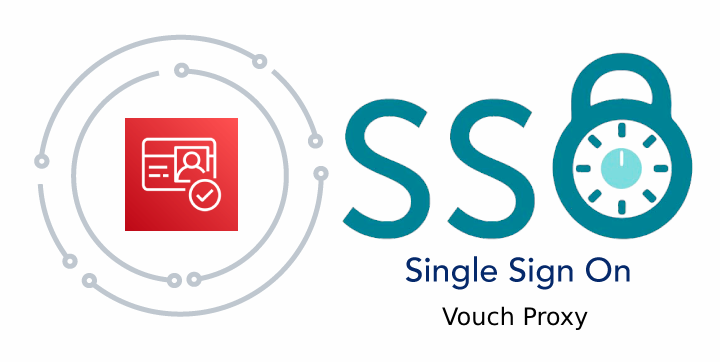

<p align="center">
  <a href="https://dev.to/vumdao">
    
  </a>
</p>
<h1 align="center">
  <div><b>Single-Sign-On By Vouch Proxy And AWS Cognito</b></div>
</h1>

## Abstract
- For kubernetes cluster, we have many observability and monitoring tools which are built-in with separated dashboard/console UIs with login-authentication. We don't want to create many domains as well as multiple accounts to handle them. This post introduces vouch proxy as an solution to provide single-sign on which supports many OAuth and OIDC login providers and can enforce authentication to AWS cognito user pool.

## Table Of Contents
* [Vouch Proxy Overview](#Vouch-Proxy-Overview)
* [What Exactly Vouch Proxy Does?](#What-Exactly-Vouch-Proxy-Does?)
* [How does vouch-proxy protect the domains?](#How-does-vouch-proxy-protect-the-domains?)
* [Setup AWS Cognito as authorize provider](#Setup-AWS-Cognito-as-authorize-provider)
* [Deploy vouch-proxy and nginx](#deploy-vouch-proxy-and-nginx)
* [Troubleshooting](#Troubleshooting)
* [Conclusion](#Conclusion)

---

## 🚀 **Vouch Proxy Overview** <a name="Vouch-Proxy-Overview"></a>
- [Vouch Proxy](https://github.com/vouch/vouch-proxy) - An SSO solution for Nginx using the [auth_request](http://nginx.org/en/docs/http/ngx_http_auth_request_module.html) module. Vouch Proxy can protect all of your websites at once.
- Vouch Proxy supports many OAuth and OIDC login providers and can enforce authentication to... This blog introduces applying vouch-proxy with AWS Cognito userpool
- In this blog post, we apply this solution for Applications such as [Solr Cloud](https://solr.apache.org/guide/6_6/getting-started-with-solrcloud.html), [AKHQ](https://akhq.io), and [glowroot](https://glowroot.org) in kubernetes cluster where vouch proxy and nginx are also deployed on.

## 🚀 **What Exactly Vouch Proxy Does** <a name="What-Exactly-Vouch-Proxy-Does"></a>
- **Diagram**

  

- **The flows**
  1. User access one of the subpath such as `/solr` for Solr Admin UI through https://sso.simflexcloud.com/solr
  2. The request is go to AWS Application load balancer and then forwarded to NGINX target group
  3. Nginx authorizes the request by calling/validating request using vouch-proxy through the internal endpoint `http://vouch:9090/validate` of kubernetes service
  4. Vouch-proxy validates and returns 200 if user already has the cache login token or returns `401` if not yet performed login
     - With 200 code, the request is redirected to target location here is Solr UI admin
     - With 401 code, the request is redirected to `https://vouch.simflexcloud.com/login?url=https://$http_host$request_uri&vouch-failcount=$auth_resp_failcount&X-Vouch-Token=$auth_resp_jwt&error=$auth_resp_err>` to login, if the login is successful, the request is redirected to target location here is Solr UI admin
  5. Default redirect is the main page or marketing page or anything you would like to show as your SSO

## 🚀 **How does vouch-proxy protect the domains?** <a name="How-does-vouch-proxy-protect-the-domains?"></a>
- Vouch-proxy (VP) supports many OAuth and OIDC login providers to authentication
- Futhermore, vouch-proxy whitelists the domains, not only the access domain but also the domain of email login. The cookie domain, the domain that VP is served from and the protected app must all be the same domain. For example, if we just whitelist the app domain such simflexcloud.com but the email is `simflex.cloud@gmail.com` it will not authorize the user
  ```
  2022-07-07T15:58:12.716Z        WARN    /auth User is not authorized: verifyUser: Email simflex.cloud@gmail.com is not within a Vouch Proxy managed domain . Please try again or seek support from your administrator
  ```

## 🚀 **Setup AWS Cognito as authorize provider** <a name="Setup-AWS-Cognito-as-authorize-provider"></a>
- Pre-requisite: Your already create coginto user for login authentication.

- Cognito userpool application client

  

- Setup vouch-proxy config with AWS cognito, replace the URLs with ones setup from cognito
  ```
  vouch:
    logLevel: debug
    port: 9090

    cookie:
      secure: false

    domains: # app domain and mail domain only
    - simflexcloud.com
    - gmail.com

  oauth:
    provider: oidc
    client_id: AWS_COGNITO_VOUCH_CLIENT_ID
    auth_url: <https://{yourCognitoDomain}.amazoncognito.com/oauth2/authorize>
    token_url: <https://{yourCognitoDomain}.amazoncognito.com/oauth2/token>
    user_info_url: <https://{yourCognitoDomain}.amazoncognito.com/oauth2/userInfo>
    scopes:
    - openid
    - email
    - profile
    callback_url: <https://{callbackURL}/auth>
  ```

## 🚀 **Deploy vouch-proxy and nginx** <a name="Deploy-vouch-proxy-and-nginx"></a>
- Go to [nginx](https://github.com/vumdao/sso-vouch-proxy/tree/master/nginx) to get Dockerfile, nginx config files to build the `nginx-gw` image
- Use the `quay.io/vouch/vouch-proxy` image to start vouch-proxy with mounting the config file to `/config/config.yml`

## 🚀 **Troubleshooting** <a name="Troubleshooting"></a>
- Getting started to align between Nginx, Vouch Proxy and your identity provider (IdP) can be tricky, vouch-proxy provides config to enable testing mode
  ```
  vouch:
    testing: true
    logLevel: debug
  ```

- With testing enable, the UI will step us to each phase of redirecting

  

  

## 🚀 **Conclusion** <a name="Conclusion"></a>
- Now we have SSO domain to access all the services conveniently and it's possible to add any more subpath for other services. The session with congito userpool token has expired time and we can update this timeout through cognito attributes.

---

<h3 align="center">
  <a href="https://dev.to/vumdao">:stars: Blog</a>
  <span> · </span>
  <a href="https://github.com/vumdao/sso-vouch-proxy">Github</a>
  <span> · </span>
  <a href="https://stackoverflow.com/users/11430272/vumdao">stackoverflow</a>
  <span> · </span>
  <a href="https://www.linkedin.com/in/vu-dao-9280ab43/">Linkedin</a>
  <span> · </span>
  <a href="https://www.linkedin.com/groups/12488649/">Group</a>
  <span> · </span>
  <a href="https://www.facebook.com/CloudOpz-104917804863956">Page</a>
  <span> · </span>
  <a href="https://twitter.com/VuDao81124667">Twitter :stars:</a>
</h3>
